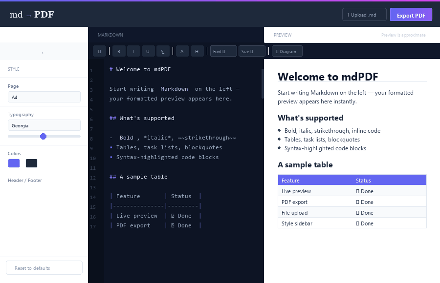

# mdPDF Desktop

Write Markdown, get a PDF. Desktop app for Windows, macOS, and Linux.



**[Download](https://github.com/ibrahimokdadov/winmdPDF/releases)** · [Web version](https://mdpdf.whhite.com) · [Live site](https://winmdpdf.whhite.com)

---

## Features

- **Live preview** — see your formatted document as you type
- **Mermaid diagrams** — flowcharts, sequence diagrams, ER diagrams, Gantt charts, and more — render correctly in both preview and PDF
- **Style sidebar** — set font family, font size, line height, margins, and header/footer text. Settings persist between sessions.
- **Format toolbar** — select text and apply bold, italic, underline, strikethrough, text color, highlight, font family, font size
- **Diagram inserter** — pick a Mermaid diagram type, a template inserts at cursor
- **File upload** — drag in any `.md` file
- **No Puppeteer** — PDF export uses Electron's built-in Chromium (`webContents.printToPDF()`). No second Chromium download, no extra install.
- **Offline, no server** — runs as a desktop app. No Docker, no cloud dependency.

## Download

Get the latest release for your platform:

| Platform | Format |
|----------|--------|
| Windows  | NSIS installer `.exe` or portable `.exe` |
| macOS    | `.dmg` |
| Linux    | `.AppImage` |

→ **[Releases page](https://github.com/ibrahimokdadov/winmdPDF/releases)**

## Development

Requires Node.js 20+.

```bash
git clone https://github.com/ibrahimokdadov/winmdPDF.git
cd winmdPDF
npm install
npm run dev        # starts Next.js + Electron together
```

### Build

```bash
npm run build      # Next.js static export + compile Electron TypeScript
npm run dist       # packages installer for current platform
```

### Tests

```bash
npm test           # runs Electron unit tests (Jest + ts-jest)
```

## How it works

```
renderer/          Next.js 14 app (static export → renderer/out/)
electron/
  main.ts          BrowserWindow, app:// protocol handler, IPC
  preload.ts       contextBridge → window.electronAPI
  pdf.ts           webContents.printToPDF() + OS save dialog
```

The renderer runs as a static site served via a custom `app://` protocol (not `file://`, which breaks Next.js absolute asset paths). PDF export flows through IPC: the renderer calls `window.electronAPI.exportPDF(markdown, settings)`, the main process opens a hidden BrowserWindow, polls until Mermaid SVGs finish rendering, then calls `printToPDF`.

## Stack

Electron 28, Next.js 14, TypeScript, Tailwind CSS, Mermaid, rehype

## Web version

The original web app (with Puppeteer-based export) is at [mdpdf.whhite.com](https://mdpdf.whhite.com) and [github.com/ibrahimokdadov/mdPDF](https://github.com/ibrahimokdadov/mdPDF).
